# Dokumentasi Arsitektur — DagoEng F&B Management

Platform: **DagoEng F&B Management**  
Brand: **DagoEng Creative Hub**  
Tagline: *Smarter F&B. Better Operations. / Smarter Operations. Better Business.*

---

## 1. Gaya Arsitektur: Feature-Oriented Modular Monolith

DagoEng F&B Management dirancang dengan pendekatan **Modular Monolith** berbasis Next.js App Router dan TypeScript. Arsitektur ini menggabungkan kohesi domain bisnis yang tinggi dengan fleksibilitas ekspansi multi-bisnis (F&B, Co-working, Commercial) di bawah naungan **Dago Creative Hub**.

```mermaid
graph TD
    subgraph ClientLayer ["Client Layer (Responsif 360px - 1440px+)"]
        Desktop["Desktop (Owner / Manager / Eksekutif)"]
        Tablet["Tablet (POS Kasir / Kitchen Display KDS)"]
        Mobile["Mobile (Waiter Floor / Customer Self-Order QR)"]
    end

    subgraph AppShell ["Application Shell & Contexts"]
        AuthCtx["AuthContext (3D Authorization: Role + Scope + Module)"]
        DateCtx["DateFilterContext (Global Presets & Periode Pembanding)"]
        OrderCtx["OrderContext (Realtime Lifecycle & Service Time Analytics)"]
        RoleSim["Dev Role Simulator (Gated: ENABLE_ROLE_SIMULATOR=true)"]
    end

    subgraph BusinessDomains ["Multi-Business Domain Layer (src/features/*)"]
        CoreAuth["auth/ & core/"]
        FnBDomain["fnb/ (POS, KDS, Menu, Tables, Orders)"]
        CoWorkDomain["coworking/ (Desks, Meeting Rooms, Memberships)"]
        CommDomain["commercial/ (Event Spaces, Tenant Rentals)"]
    end

    subgraph ServerGuard ["Server Authorization Layer (3-Dimensional)"]
        RBAC["Dimensi 1: Role Authorization (requirePermission, requireRole)"]
        ScopeGuard["Dimensi 2: Scope Hierarchy (PLATFORM -> ORG -> UNIT -> TENANT -> OUTLET)"]
        ModuleGuard["Dimensi 3: Module Activation Guard (assertModuleActive)"]
    end

    subgraph StorageLayer ["Data & Storage Layer"]
        Prisma["Prisma ORM (Schema Terstruktur & Ekstensibel)"]
        Postgres["PostgreSQL Database (Isolasi Lingkungan Dev & Test)"]
    end

    ClientLayer --> AppShell
    AppShell --> BusinessDomains
    BusinessDomains --> ServerGuard
    ServerGuard --> StorageLayer
```

---

## 2. Pilar-Pilar Utama Arsitektur

### 2.1 Otorisasi 3-Dimensi (3D Authorization)
Platform mengimplementasikan model otorisasi modern tanpa ketergantungan nama role statis (no hardcoded roles):
1. **Dimensi 1: Role Permissions**: Izin fungsional spesifik (`orders:read`, `kds:write`, `analytics:consolidated`, dll).
2. **Dimensi 2: Access Scope Level**:
   - `PLATFORM`: Pengelolaan platform DagoEng lintas tenant.
   - `ORGANIZATION`: Eksekutif Dago Creative Hub (akses konsolidasi seluruh unit).
   - `BUSINESS_UNIT`: Pengelola unit bisnis spesifik (F&B, Co-working, Commercial).
   - `TENANT`: Pemilik brand/tenant mandiri (misal: *Kopi Senja*).
   - `OUTLET`: Operasional gerai lokal spesifik (misal: *Singaraja*, *Denpasar*, *Ubud*).
3. **Dimensi 3: Business Module Activation**: Modul `CORE`, `FNB`, `CO_WORKING`, `COMMERCIAL` yang dapat diaktifkan/dinonaktifkan per organisasi via pengaturan bisnis.

### 2.2 P0 Order Lifecycle & Service Time Tracking
Pelacakan waktu layanan pesanan end-to-end secara detail:
- **State Machine Siklus Pesanan**:
  `NEW` ➔ `CONFIRMED` ➔ `KITCHEN_RECEIVED` ➔ `COOKING` ➔ `READY` ➔ `SERVED` ➔ `COMPLETED` (atau `CANCELLED`).
- **Segmen Durasi yang Diukur**:
  - *Queue Time*: Waktu dari pesanan dibuat hingga diterima dapur.
  - *Cooking Time*: Waktu aktif persiapan/memasak di dapur.
  - *Serving Time*: Waktu dari makanan matang hingga disajikan ke meja.
  - *Total Service Time*: Akumulasi waktu dari pesanan masuk hingga tersaji ke customer.
- **SLA Alerting & Diagnostik Bottleneck**: Klasifikasi real-time `ON_TIME` (≤15 mnt), `AT_RISK` (15–25 mnt), dan `DELAYED` (>25 mnt) serta diagnosis otomatis akar keterlambatan (Dapur / Waiter / Antrean).

### 2.3 Keamanan Sesi Database-Backed Murni
- Token acak kriptografis hanya disimpan pada cookie browser berfitur `HttpOnly`, `Secure`, `SameSite=Lax`.
- Database hanya menyimpan **SHA-256 hash** (`sessionTokenHash`) dari token.
- Pembatalan sesi (logout) langsung menghapus baris session di database.

### 2.4 Model Pelanggan Tanpa Akun (Decoupled Customer Experience)
- Customer tidak diwajibkan mendaftar akun pengguna untuk memesan via QR meja.
- Sesi pesanan dikaitkan langsung dengan token meja dan `orderCode` unik.
