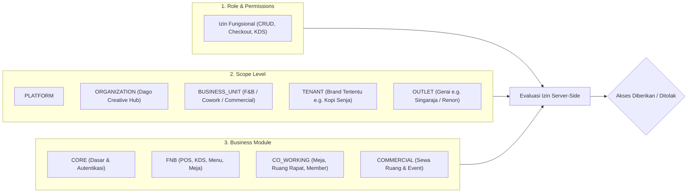

# Spesifikasi Otorisasi 3-Dimensi & RBAC — DagoEng F&B Management

Platform: **DagoEng F&B Management**  
Brand: **DagoEng Creative Hub**  
Tagline: *Smarter F&B. Better Operations.*

---

## 1. Konsep Otorisasi 3-Dimensi (3D Authorization Matrix)

Akses pengguna di dalam sistem DagoEng F&B Management dihitung berdasarkan irisan 3 sumbu independen:

$$\text{Akses Diizinkan} = \text{Role Permission} \cap \text{Scope Hierarchy} \cap \text{Active Business Module}$$

---

## 2. Persona Pengguna Bawaan (Default Personas)

| Persona / Role | Scope Level | Tenant / Brand | Modul Terkait | Cakupan Akses |
| :--- | :--- | :--- | :--- | :--- |
| **Dago Creative Hub Owner** | `ORGANIZATION` | Konsolidasi Semua | `FNB`, `CO_WORKING`, `COMMERCIAL` | Laporan eksekutif seluruh unit bisnis Dago Creative Hub |
| **Kopi Senja Brand Owner** | `TENANT` | Kopi Senja | `FNB` | Seluruh gerai Kopi Senja (Singaraja, Denpasar, Ubud) |
| **Co-working Space Manager** | `BUSINESS_UNIT` | Dago Co-work Hub | `CO_WORKING` | Manajemen ruang kerja, member, dan reservasi |
| **Commercial Space Manager** | `BUSINESS_UNIT` | Dago Commercial | `COMMERCIAL` | Manajemen tenant sewa komersial dan area event |
| **Outlet Manager Singaraja** | `OUTLET` | Kopi Senja Singaraja | `FNB` | Operasional lengkap gerai Singaraja |
| **Kasir Gerai Singaraja** | `OUTLET` | Kopi Senja Singaraja | `FNB` | POS Kasir dan kelola shift laci kasir |
| **Dapur / Kitchen Staff** | `OUTLET` | Kopi Senja Singaraja | `FNB` | Antrean KDS dan pencatatan waktu masak |
| **Pelayan / Waiter** | `OUTLET` | Kopi Senja Singaraja | `FNB` | Pemesanan meja dan penyajian pesanan |
| **Super Admin Platform** | `PLATFORM` | Multi-Tenant Global | `CORE`, `FNB`, `CO_WORKING`, `COMMERCIAL` | Pengaturan tenant, lisensi modul, dan kesehatan sistem |

---

## 3. Developer Role Simulator

Simulator peran memungkinkan pengujian instan antar semua kombinasi scope dan modul:
- Dikendalikan oleh environment variable: `ENABLE_ROLE_SIMULATOR=true`.
- **Dinonaktifkan di Produksi**: Pada mode produksi (`NODE_ENV === 'production'`), bilah simulator otomatis dihilangkan dari DOM dan ditolak pada level API.
