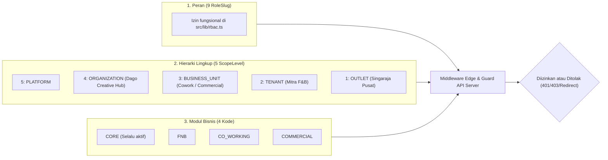

# Otorisasi 3-dimensi dan matriks RBAC

DagoEng Management mengevaluasi hak akses setiap pengguna melalui irisan tiga sumbu independen di sisi klien maupun server:

$$\text{Akses Diizinkan} = \text{Role Permission} \cap \text{Scope Hierarchy} \cap \text{Active Business Module}$$

```mermaid
flowchart LR
    subgraph Axis1 ["1. Peran (9 RoleSlug)"]
        R1["Izin fungsional di src/lib/rbac.ts"]
    end

    subgraph Axis2 ["2. Hierarki Lingkup (5 ScopeLevel)"]
        S1["5: PLATFORM"]
        S2["4: ORGANIZATION (Dago Creative Hub)"]
        S3["3: BUSINESS_UNIT (Cowork / Commercial)"]
        S4["2: TENANT (Mitra F&B)"]
        S5["1: OUTLET (Singaraja Pusat)"]
    end

    subgraph Axis3 ["3. Modul Bisnis (4 Kode)"]
        M1["CORE (Selalu aktif)"]
        M2["FNB"]
        M3["CO_WORKING"]
        M4["COMMERCIAL"]
    end

    Axis1 --> Guard["Middleware Edge & Guard API Server"]
    Axis2 --> Guard
    Axis3 --> Guard
    Guard --> Result{"Diizinkan atau Ditolak (401/403/Redirect)"}
```

## 1. Sembilan peran sistem dan cakupan rute

Penegakan akses rute dijalankan oleh `src/middleware.ts` dan `src/lib/route-guard.ts` pada 18 awalan rute dashboard, serta diperkuat di tiap endpoint API menggunakan `getRequestAuthUser` di `src/lib/server-auth.ts`:

| `RoleSlug` | Lingkup umum | Rute bawaan | Hak operasional dan pembatasan utama |
|---|---|---|---|
| `SUPER_ADMIN` | `PLATFORM` | `/dashboard` | Akses penuh lintas modul, pengaturan platform, pengelolaan kebijakan bagi hasil, manajemen karyawan, dan diagnostik `/api/system/health`. |
| `OWNER` (Hub) | `ORGANIZATION` | `/dashboard` | Akses eksekutif konsolidasi seluruh unit bisnis Dago Creative Hub, pengubahan kebijakan bagi hasil mitra, dan persetujuan langsung void atau refund. |
| `OWNER` (Mitra F&B) | `TENANT` | `/dashboard` | Terkunci ketat pada `tenantId` miliknya di dashboard, pesanan, menu, KDS, inventori, dan laporan bagi hasil. Diblokir oleh `TENANT_OWNER_BLOCKED_PREFIXES` dari `/coworking`, `/commercial`, `/employees`, `/events-admin`, `/activity-log`, `/customers`, dan `/events/checkin`. |
| `MANAGER` | `BUSINESS_UNIT` / `ORGANIZATION` | `/commercial` atau `/coworking` | Mengelola operasional unit bisnis, inventori, laporan, dan persetujuan void atau refund tanpa perlu memasukkan PIN supervisor. |
| `CASHIER` | `OUTLET` | `/pos` | Mengoperasikan kasir POS, buka/tutup shift laci kas, dan klaim pesanan meja. Diblokir dari ekspor data pelanggan CRM dengan nomor telepon dan email pelanggan tersamar (`S-09`). Wajib memasukkan `SUPERVISOR_OVERRIDE_PIN` untuk konfirmasi manual QRIS statis, void, dan refund (`V-05`, `V-13`). |
| `KITCHEN_STAFF` | `OUTLET` | `/kitchen` | Mengelola papan KDS (`/kitchen`) yang difilter ketat hanya untuk item milik mitranya (`V-09`). Nominal rupiah pada pesanan disembunyikan (`—`), tombol refund dinonaktifkan, dan akses ke `/customers` maupun `/pos` ditolak (`V-19`). |
| `INVENTORY_STAFF` | `OUTLET` | `/inventory` | Mengelola stok bahan baku, Purchase Order, dan Stock Opname pada `/inventory`. |
| `WAITER` | `OUTLET` | `/waiter` | Mengelola status meja lantai dan menerima notifikasi pesanan siap saji dari dapur pada `/waiter` serta `/tables`. |
| `CHECKIN_STAFF` | `ORGANIZATION` | `/events/checkin` | Khusus meja registrasi tiket event hari berjalan WITA (`/events/checkin`). Diblokir penuh dari POS, KDS, CRM, dan AI Insight (`V-19`). |
| `CUSTOMER` | `OUTLET` / `TENANT` | `/customer` atau `/events/portal` | Pemesanan mandiri via QR meja, pemesanan tiket event, atau pengelolaan acara komunitas bagi akun yang terdaftar sebagai organizer. |

Daftar email dan kata sandi akun pengujian untuk setiap peran tersedia di [AKUN_SISTEM.md](./AKUN_SISTEM.md).

## 2. Matriks peran cetak struk (`V-18`)

Pengaturan distribusi cetak struk disimpan di `STORAGE_settlement_receipt_policy.json` dan hanya dapat diubah oleh `SUPER_ADMIN` atau `OWNER` tingkat organisasi (`PUT /api/settings/settlement-receipt`):

- **Struk kasir dan pelanggan (`cashierReceiptRoles`).** Secara bawaan diizinkan bagi `SUPER_ADMIN`, `OWNER`, `MANAGER`, dan `CASHIER`.
- **Tiket dapur tanpa harga (`kitchenReceiptRoles`).** Secara bawaan diizinkan bagi `SUPER_ADMIN`, `OWNER`, `MANAGER`, `CASHIER`, `KITCHEN_STAFF`, dan `WAITER`.

## 3. Keamanan sesi, simulator peran, dan mode UAT vs produksi

- **Verifikasi tanpa header klien.** `getRequestAuthUser` di `src/lib/server-auth.ts` tidak pernah mempercayai header `x-user-*` dari peramban. Identitas pengguna selalu diverifikasi dari `dagoeng_session` (hash SHA-256 di database), `dagoeng_edge_token` (HMAC-SHA256 `SESSION_SECRET`), serta pemeriksaan daftar pencabutan di `STORAGE_session_revocations.json`.
- **Bilah simulator peran (`ENABLE_ROLE_SIMULATOR`).** Mengaktifkan bilah pengalih persona cepat untuk pengembangan lokal dan QA. Pada `NODE_ENV=production`, bilah simulator disembunyikan dari antarmuka, dan variabel `ENABLE_ROLE_SIMULATOR` saja tetap menolak login demo untuk peran berhak tinggi (`SUPER_ADMIN`, `OWNER`, `MANAGER`).
- **Sakelar UAT (`ALLOW_DEMO_UAT`) dan penguncian produksi (`DISABLE_DEMO_LOGIN`).** Saat ini `next.config.js` menyetel `ALLOW_DEMO_UAT: 'true'` supaya pimpinan dan penguji UAT dapat masuk ke ke-16 akun demo pada server staging. Ketika aplikasi beralih ke produksi publik pasca-UAT, operator wajib menyetel `DISABLE_DEMO_LOGIN=true` pada environment server untuk mematikan seluruh login demo dan cookie `dagoeng_active_persona`.
