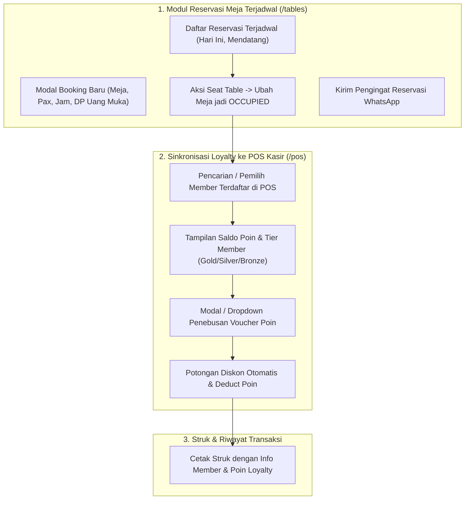

# Rencana Implementasi: Reservasi Meja Terjadwal & Sinkronisasi Voucher Loyalty Member ke POS

Penyempurnaan sistem operasional yang mencakup **Manajemen Reservasi Meja Terjadwal** pada modul Meja (`/tables`) serta **Sinkronisasi Otomatis Voucher & Poin Loyalty Member** pada modul Kasir POS (`/pos`).

---

## 1. User Review Required

> [!IMPORTANT]
> **Alur Check-in Reservasi ke POS Kasir**: Ketika tamu reservasi datang dan staf mengklik **"Dudukkan Tamu (Seat Table)"** di halaman `/tables`:
> - Status meja otomatis berubah dari `RESERVED` menjadi `OCCUPIED`.
> - Status reservasi berubah menjadi `SEATED`.
> - Kasir dapat langsung membuka POS meja tersebut dengan data nama tamu & nomor WhatsApp yang sudah terisi otomatis.

> [!TIP]
> **Penebusan Voucher Loyalty Member (1-Klik di POS)**:
> - Kasir dapat mencari/memilih akun member terdaftar (misal: *Ketut Dian - Gold (340 Pts)*).
> - Tersedia opsi tukar poin loyalty (*Redeem 100 Pts = Diskon Rp 25.000* atau *Diskon Khusus Member Tier Gold 15%*).
> - Potongan diskon langsung masuk ke kalkulasi keranjang dan tercatat rapi di struk digital thermal.

---

## 2. Fitur & Komponen yang Akan Dibangun

---

## 3. Perubahan & File yang Akan Dimodifikasi

### Modul Meja & Reservasi
#### [MODIFY] [tables/page.tsx](file:///d:/Magang%20Shandi/DagoEng%20F&B%20Management/src/app/(dashboard)/tables/page.tsx)
- Tambahkan tab navigasi: **"Denah Meja Visual (Floor Plan)"** dan **"Buku Reservasi Terjadwal"**.
- Tambahkan state data reservasi (ID, Nama Tamu, No. WhatsApp, Meja, Tanggal/Jam, Jumlah Pax, Catatan, DP / Uang Muka, Status: `CONFIRMED`, `SEATED`, `CANCELLED`, `COMPLETED`).
- Modal **"+ Buat Reservasi Baru"** dengan validasi kapasitas meja dan deposit DP.
- Tombol aksi: **Dudukkan Tamu (Seat Table)**, **Buka POS Kasir**, dan **Batalkan Reservasi**.

### Modul POS & Loyalty
#### [MODIFY] [pos/page.tsx](file:///d:/Magang%20Shandi/DagoEng%20F&B%20Management/src/app/(dashboard)/pos/page.tsx)
- Tambahkan komponen pemilih akun member terdaftar di panel keranjang POS.
- Tampilkan badge Tier Member (*Gold / Silver / Bronze*) dan saldo Poin Loyalty.
- Tombol **"Klaim Voucher Poin"**: Modal pilihan voucher (Voucher Rp 25.000 [100 Poin], Free Croissant [150 Poin], Diskon Member Gold 15%).
- Kalkulasi otomatis potongan diskon voucher pada subtotal, PB1, dan grand total.
- Simpan data loyalty pada `POSReceiptData`.

#### [MODIFY] [types.ts](file:///d:/Magang%20Shandi/DagoEng%20F&B%20Management/src/features/pos/types.ts)
- Tambahkan field `loyaltyMember?: { id: string; name: string; tier: string; pointsUsed: number; pointsRemaining: number; voucherApplied?: string }` pada `POSReceiptData`.

#### [MODIFY] [ReceiptModal.tsx](file:///d:/Magang%20Shandi/DagoEng%20F&B%20Management/src/features/pos/ReceiptModal.tsx)
- Menampilkan rincian loyalty member dan potongan voucher poin pada struk thermal.

---

## 4. Rencana Verifikasi

### Pengujian Otomatis (Unit Testing)
- Menambahkan unit test baru di [tests/pos-transaction.test.ts](file:///d:/Magang%20Shandi/DagoEng%20F&B%20Management/tests/pos-transaction.test.ts) dan test suite reservasi:
  - Memverifikasi kalkulasi diskon voucher poin loyalty dan pengurangan poin member.
  - Memverifikasi transisi status meja dari `RESERVED` ke `OCCUPIED` saat tamu check-in reservasi.

### Pengujian Manual di Browser
1. Buka halaman `/tables`, pindah ke tab **Buku Reservasi Terjadwal**.
2. Klik **"+ Buat Reservasi Baru"** untuk Meja `VIP-01` (8 Orang, Jam 18:30 WITA, DP Rp 100.000).
3. Klik tombol **"Dudukkan Tamu (Seat Table)"** ➔ periksa status meja `VIP-01` di denah berubah menjadi `OCCUPIED`.
4. Buka halaman `/pos`, pilih member **Ketut Dian (Gold - 340 Pts)**.
5. Klik **"Klaim Voucher"** ➔ pilih *Voucher Potongan Rp 25.000 (Tukar 100 Poin)*.
6. Periksa apakah diskon terpotong di total tagihan dan tertera di struk digital saat pembayaran selesai.
