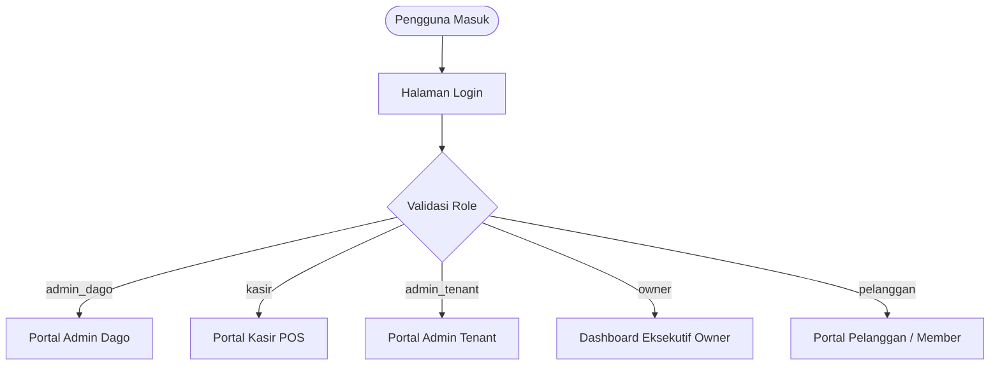
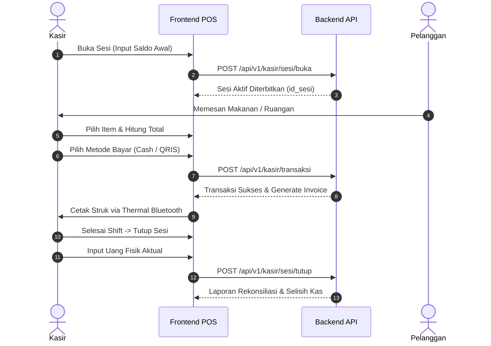
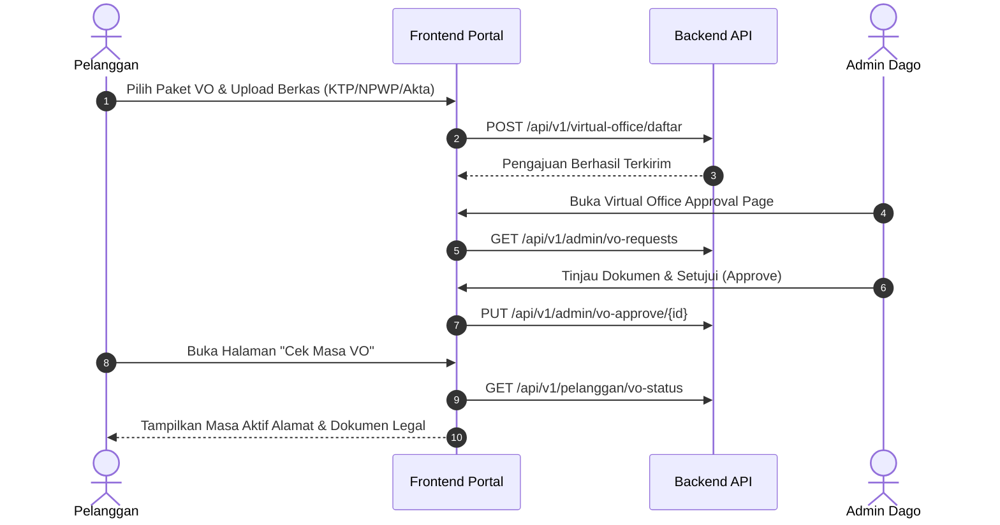

# Product Requirement Document (PRD) & Analisis Sistem
## Sistem Manajemen Terintegrasi Working Space Dago

---

## 1. Executive Summary (Ringkasan Eksekutif)

### 1.1 Latar Belakang & Tujuan
**Sistem Working Space Dago** adalah platform terpadu *end-to-end* yang dirancang untuk mendigitalisasi dan mengotomatisasi seluruh operasional *coworking space*, penyewaan kantor (*Private & Virtual Office*), reservasi *event space*, kemitraan *tenant* makanan & minuman (F&B), hingga sistem *Point of Sale* (POS) kasir dan analitik eksekutif untuk pemilik bisnis (*Owner*).

### 1.2 Nilai Bisnis (Business Value)
1. **Peningkatan Efisiensi Operasional**: Mengeliminasi pencatatan manual untuk booking ruangan, sesi kasir, dan rekonsiliasi kas.
2. **Multi-Tenant Collaboration**: Memisahkan manajemen merchant/tenant F&B dengan sistem pembagian hasil (*revenue sharing*) otomatis.
3. **Transparansi Finansial**: Memfasilitasi audit real-time untuk omset harian, laba bersih, beban biaya bulanan (*operational expenditure*), kewajiban pajak, dan hutang piutang tenant.
4. **Pengalaman Pengguna Tanpa Hambatan (*Seamless UX*)**: Memberikan pelanggan kemudahan memesan ruangan, berlangganan membership, cek sisa kredit waktu, dan verifikasi berkas legal Virtual Office.

---

## 2. Arsitektur Teknis & Tech Stack

| Komponen | Teknologi / Pustaka | Keterangan & Peruntukan |
| :--- | :--- | :--- |
| **Frontend Core** | React 19, Vite 7 | Arsitektur SPA (*Single Page Application*) performa tinggi dengan Fast HMR |
| **Styling & UI** | Tailwind CSS 4, Ant Design 5 (Antd) | Desain modular modern, responsif, dan kaya komponen form/tabel enterprise |
| **Routing & Auth Guard** | React Router DOM 7 | RBAC Protected Routes, Sesi Shift Guards, Dynamic Sub-routing |
| **State & Storage** | React Context API, `encrypt-storage` | Global Auth State, manajemen sesi shift terenkripsi, sessionStorage caching |
| **Visualisasi Data** | Chart.js, `@ant-design/charts` | Grafik tren penjualan, perbandingan performa F&B vs Ruangan, donut chart omset |
| **Hardware Integration** | Web Bluetooth & Web Serial API | `PrinterFinder.js` & `PrinterService.js` untuk cetak struk kasir thermal POS |
| **Export Engine** | `exceljs`, `xlsx`, `file-saver` | Generator laporan Excel multi-sheet untuk audit Owner & Admin |
| **Ikon & Animasi** | Lucide React, Ant Icons, Framer Motion | Mikro-interaksi dan ikonografi intuitif |
| **Backend Integration** | RESTful API, JWT Bearer Auth | Endpoint JSON standar dengan dukungan `multipart/form-data` untuk upload berkas |

---

## 3. Matriks Peran & Hak Akses (Role-Based Access Control / RBAC)

### Rincian Matriks Hak Akses:

| Fitur / Modul | Pelanggan | Kasir (POS) | Admin Tenant | Admin Dago | Owner |
| :--- | :---: | :---: | :---: | :---: | :---: |
| **Pemesanan Ruangan / Desk** | ✅ (Booking & Bayar) | ✅ (On the Spot) | ❌ | ✅ (Master & Monitor) | 👁️ (Laporan) |
| **Virtual & Private Office** | ✅ (Pengajuan & Cek) | ❌ | ❌ | ✅ (Approval Berkas) | 👁️ (Laporan) |
| **Event Spaces** | ✅ (Pengajuan) | ❌ | ❌ | ✅ (Approval & Master) | 👁️ (Laporan) |
| **Sistem POS & Buka Sesi Shift** | ❌ | ✅ (Penuh) | ✅ (Sesi Tenant) | ❌ | 👁️ (Audit Sesi) |
| **Cetak Struk Thermal Bluetooth** | ❌ | ✅ | ✅ | ❌ | ❌ |
| **Kelola Menu & Stok F&B** | ❌ | 👁️ (Lihat Menu) | ✅ (Kelola Stok) | ✅ (Master Data) | 👁️ (Statistik) |
| **Master Data Sistem** | ❌ | ❌ | ❌ | ✅ (Kelola Penuh) | 👁️ |
| **Cost Bulanan & Hutang Tenant** | ❌ | ❌ | ❌ | ✅ | 👁️ |
| **Bagi Hasil & Laporan Pajak** | ❌ | ❌ | 👁️ (Data Sendiri) | 👁️ | ✅ (Penuh & Ekspor) |

---

## 4. Rincian Spesifikasi Fitur per Modul

### 4.1 Modul Pelanggan (Customer Facing)
1. **Katalog & Detail Ruangan**:
   - Pemilihan tipe ruangan: Hot Desk, Dedicated Desk, Meeting Room, Private Office.
   - Pengecekan ketersediaan jadwal dan fasilitas secara *real-time*.
2. **Alur Booking & Pembayaran**:
   - Kalkulasi durasi otomatis berdasarkan tarif per jam / harian / bulanan.
   - Penerapan voucher promo diskon.
   - Integrasi bukti pembayaran dan kode transaksi QR.
3. **Layanan Membership**:
   - Pendaftaran paket langganan member.
   - Fitur **Cek Kredit Membership** untuk memantau sisa jam kuota penggunaan ruangan.
4. **Virtual Office (VO) & Private Office**:
   - Formulir pendaftaran VO dengan unggah dokumen legalitas (KTP, NPWP, Akta PT).
   - Fitur **Cek Masa VO** untuk memantau status persetujuan, masa aktif sewa alamat, dan notifikasi perpanjangan.
5. **Event Spaces & Info Acara**:
   - Penjelajahan acara/workshop yang diselenggarakan di Working Space.
   - Pengajuan reservasi aula / *event space* untuk kebutuhan komunitas atau korporat.
6. **Riwayat Transaksi**:
   - Rekap seluruh transaksi reservasi, langganan membership, dan status approval.

---

### 4.2 Modul Kasir / POS (Point of Sale & Shift Management)
1. **Manajemen Sesi Kerja Kasir (Shift Control)**:
   - **Buka Sesi**: Input modal awal (*cash in hand* / saldo awal) sebelum memulai transaksi.
   - **Takeover / Join Sesi**: Mendukung perpindahan kasir pada sesi yang sama tanpa duplikasi pencatatan.
   - **Tutup Sesi & Rekonsiliasi**: Input saldo akhir aktual fisik dan komputasi otomatis selisih kas (*over/short*).
   - **Riwayat Sesi**: Melihat riwayat rincian penjualan pada shift-shift sebelumnya.
2. **Sistem POS Penjualan**:
   - Katalog produk F&B multi-tenant dengan filter kategori dan pencarian cepat.
   - Pemesanan gabungan (F&B + Sewa Ruangan / Biaya Cetak / Tambahan Fasilitas).
   - Metode pembayaran fleksibel: Tunai, QRIS, Transfer Bank, Debit/Kredit.
3. **Integrasi Perangkat Keras (Hardware Printer)**:
   - Pencarian otomatis printer thermal melalui Web Bluetooth / Serial (`PrinterFinder.js`).
   - Format cetak struk siap pakai dengan logo, rincian pesanan, nomor meja, kasir, dan footer QR code.
4. **Laporan Pembayaran Kasir**:
   - Rekap transaksi real-time per shift, rincian per metode bayar, dan cetak laporan penutupan kas.

---

### 4.3 Modul Admin Dago (Back-Office & Operations)
1. **Pusat Master Data**:
   - **Data Pengguna & Role**: Manajemen akun staf, kasir, tenant, dan pelanggan.
   - **Data Tenant**: Pendaftaran stand/vendor F&B, skema komisi bagi hasil, dan kontak penanggung jawab.
   - **Data Produk**: Pengaturan kategori produk, harga modal, harga jual, dan status ketersediaan.
   - **Kategori & Ruangan**: Manajemen kapasitas ruangan, foto ruangan, harga sewa per jam/hari/bulan, dan fasilitas.
   - **Promo & Diskon**: Pembuatan kupon diskon dengan syarat kuota, minimal transaksi, dan periode berlaku.
   - **Acara / Event**: Publikasi info workshop, seminar, dan kalender kegiatan working space.
2. **Approval Center**:
   - Verifikasi berkas legal pendaftaran *Virtual Office* (terima/tolak dokumen dengan catatan).
   - Persetujuan pemesanan *Event Space*.
3. **Manajemen Biaya Operasional (Cost Bulanan)**:
   - Pencatatan pengeluaran rutin (listrik, internet broadband, air, pemeliharaan, kebersihan).
4. **Manajemen Hutang & Tagihan Tenant**:
   - Monitoring piutang sewa booth tenant dan biaya utilitas merchant.

---

### 4.4 Modul Admin Tenant (Merchant Partner)
1. **Live Order Monitor**:
   - Penerimaan pesanan masuk dari kasir secara real-time.
   - Update status pesanan: *Menunggu -> Diproses -> Siap Diambil / Selesai*.
2. **Manajemen Stok Mandiri**:
   - Update ketersediaan produk (Ready / Habis / Stok Terbatas) tanpa harus meminta admin pusat.
3. **Riwayat Penjualan Tenant**:
   - Rangkuman omset spesifik untuk tenant yang bersangkutan.

---

### 4.5 Modul Owner (Executive Business Intelligence)
1. **Dasbor Finansial Komprehensif**:
   - Metrik utama: Total Pendapatan Kotor (Gross Revenue), Biaya Operasional, Laba Bersih (Net Profit), Rata-rata Nilai Transaksi (AOV).
   - Grafik tren harian, mingguan, dan bulanan.
2. **Analisis Performa Bisnis**:
   - Komparasi kontribusi pendapatan: Sektor F&B Tenant vs Sewa Ruangan Coworking vs Virtual Office.
   - Produk terlaris (*Top Selling Items*) dan ruangan terpopuler (*Occupancy Rate*).
3. **Kalkulasi Bagi Hasil (Revenue Share)**:
   - Rekapitulasi porsi bagi hasil bersih untuk pengelola working space dan masing-masing tenant mitra.
4. **Laporan Pajak & Kepatuhan**:
   - Perhitungan estimasi Pajak Pembangunan (PB1/Restoran) dan PPh atas sewa ruangan.
5. **Ekspor Multi-Sheet Excel**:
   - Ekspor otomatis ke file `.xlsx` berformat rapi dengan formula terstruktur untuk laporan pembukuan akuntansi.

---

## 5. Diagram Alur Bisnis (Business Workflows)

### 5.1 Siklus Sesi Kasir & Transaksi POS

### 5.2 Alur Layanan Virtual Office (VO)

---

## 6. Matriks Komparasi untuk Evaluasi & Benchmarking Project

Tabel ini dapat Anda gunakan sebagai acuan untuk membandingkan sistem ini dengan project atau produk *coworking management* sejenis:

| Parameter Evaluasi | Keunggulan Sistem Working Space Dago | Solusi Standar / Kompetitor Umum | Nilai Tambah bagi Bisnis |
| :--- | :--- | :--- | :--- |
| **Cakupan Bisnis (Scope)** | **All-in-One**: Menggabungkan Coworking + Virtual Office + POS F&B Tenant + Bagi Hasil + Laporan Pajak dalam satu sistem. | Biasanya terpisah (aplikasi booking ruangan sendiri, aplikasi POS kasir terpisah). | Efisiensi lisensi software dan sentralisasi database transaksi. |
| **Sistem Shift Kasir** | Ada fitur Buka/Tutup Sesi, *Takeover* sesi antar kasir, dan rekonsiliasi selisih kas fisik vs sistem. | Banyak POS kasir hanya mencatat total tanpa sistem audit shift berantai. | Mengurangi risiko kebocoran kas kasir. |
| **Kemitraan Tenant** | Memiliki modul khusus bagi tenant untuk memantau pesanan masuk dan mengubah stok secara mandiri. | Tenant harus melapor manual ke admin jika menu habis. | Mengurangi kesalahan order menu yang stoknya sudah habis. |
| **Hardware Integration** | Terintegrasi langsung dengan Web Bluetooth & Serial API untuk printer thermal. | Memerlukan aplikasi jembatan (*desktop driver bridge*) terpisah. | Setup kasir lebih praktis cukup dari browser tablet/laptop. |
| **Modul Finansial Owner** | Dilengkapi fitur Laporan Pajak dan kalkulasi Bagi Hasil Tenant otomatis serta ekspor Excel multi-sheet. | Ekspor data mentah (CSV biasa) yang harus diolah manual kembali oleh akuntan. | Menghemat waktu penyusunan laporan keuangan bulanan. |
| **Pengelolaan Member** | Fitur Cek Kredit Waktu & Cek Masa Virtual Office mandiri untuk pelanggan. | Pelanggan harus selalu menanyakan sisa kuota ke resepsionis/front desk. | Meningkatkan kepuasan dan kemandirian pelanggan (*self-service*). |

---

## 7. Rekomendasi Pengembangan Lanjutan (Next Roadmap)

1. **Payment Gateway Otomatis**: Integrasi penuh dengan Midtrans / Xendit untuk auto-verifikasi pembayaran QRIS dan Virtual Account tanpa upload manual bukti transfer.
2. **WhatsApp Notification Engine**: Notifikasi otomatis via WA ke pelanggan saat dokumen Virtual Office disetujui atau kuota jam membership hampir habis.
3. **Smart Door Lock / Access Card Integration**: Sinkronisasi booking ruangan dengan kunci pintu digital berbasis IoT / PIN dinamis.
4. **PWA (Progressive Web App)**: Pengaktifan fitur offline caching dan instalasi langsung di layar utama smartphone kasir maupun tenant.
